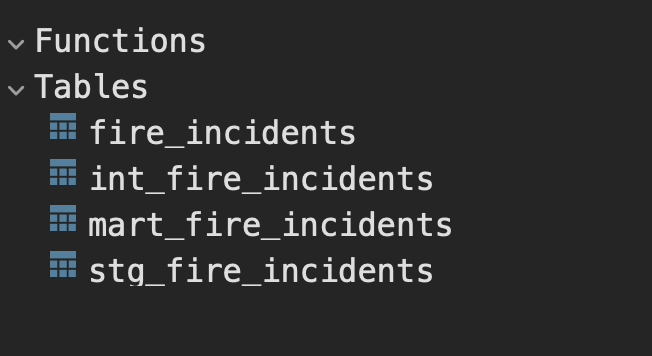
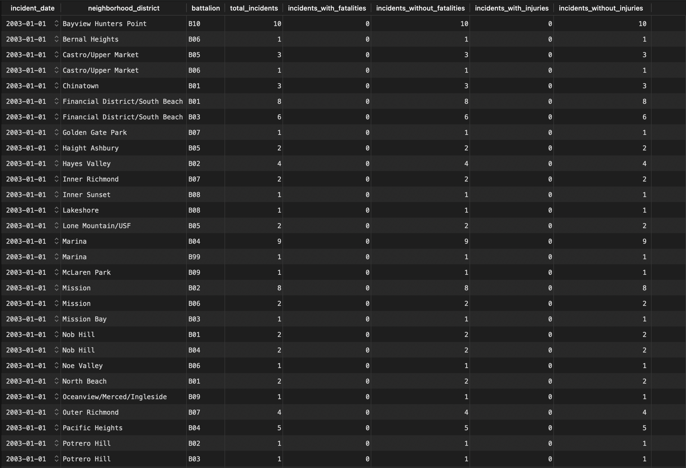

# fire-incidents-etl  
This repository is a practical example of a process for ingestion, transformation, and analysis of San Francisco's fire incident data using public data available at: https://data.sfgov.org/Public-Safety/Fire-Incidents/wr8u-xric/about_data

# Project Structure  
The project is divided into two main stages:

### 1 - Data Ingestion  
Process responsible for reading input CSV files and storing them into a target PostgreSQL database.

Process steps:

* Read the input CSV using Spark and perform an initial validation by applying the correct schema while reading the data
* Convert column names to `snake_case`
* Filters data based on input arguments
* Stores data into a temporary table in the local PostgreSQL database
* Performs a `INSERT ... ON CONFLICT DO NOTHING` command to insert the new data into the final table, using the `incident_number` column as primary key, which must not contain duplicates
* Temporary table is deleted

Summary of the process:

* Process located in the `fire_incident_ingestion` folder
* Technologies:
    * Spark (PySpark) for reading and validating input files
    * PostgreSQL as datawarehouse
* File structure:
    * `input` folder: Folder where the input file is added (in this case, it can be downloaded manually from the link above)
    * `fire_incidents_ingestion.py`: Main script containing the logic for data ingestion and validations
    * `schema.py`: Auxiliar file with the Spark schema for correct input data parsing
    * `config.py`: Configuration file containing settings like logging and project arguments
    * `create_raw_fire_incidents.sql`: SQL file used to create the initial raw table in the PostgreSQL database

### 2 - Data Transformation  
Process responsible for building a medallion data model, cleaning the data in the bronze and silver layers, and creating insights and analysis in the gold layer.

As an example, the gold layer includes an analysis indicating the total number of incidents, number of incidents with and without injuries and fatalities.

* Process located in the `fire_incident_transformations` folder
* Technologies:
    * dbt for building the data lake
    * PostgreSQL as the datawarehouse for transformations
* dbt model structure:
    * `bronze` folder: Reads raw files populated by the ingestion process and performs an initial cleaning, removing records where `neighborhood_district` and `battalion` are empty (as an example)
    * `silver` folder: Second layer of normalization and cleaning (for this example, we are just selecting desired columns)
    * `gold` folder: Business analytics and insights layer

# How to Run the Full Project

To run the project, the following must already be installed on your machine:
* Python 3
* Docker  
* Spark  

Below are the sequential steps to execute the project:

### 0 - Create the `.env` file  

The step 0 of the project is to create a new `.env` file in the root folder and copy the content from `.env_DEV`.

### 1 - Create the Local Database  
To create the local PostgreSQL database, use the `Dockerfile` located in the `local_database` folder.

* 1.1 - Go to the `local_database` folder

* 1.2 - Run the following command in the terminal to build the database image (for simplicity, the database name and password are hardcoded in the file):

```
docker build -t local-postgres-db ./
```

* 1.3 - Run the following command to initiate the container with the database:

```
docker run -d --name local-postgresdb-container -p 5432:5432 local-postgres-db
```

* 1.4 - The connection details are available in the `.env_DEV` file

### 2 - Create the Python Virtual Environment  

* 2.1 - In the root folder of the project, create the virtual environment:

```
python -m venv venv
```

* 2.2 - Activate the virtual environment (MacOS command):

```
source venv/bin/activate
```

* 2.3 - Install the dependencies:

```
pip install -r requirements.txt
```

### 3 - Run the Ingestion Process  

* 3.1 - Go to the folder containing the ingestion process files, `fire_incident_ingestion`

* 3.2 - Use the SQL command in `create_raw_fire_incidents.sql` to create the table in the local PostgreSQL database

* 3.3 - Run the ingestion process with the command:

```
python fire_incidents_ingestion.py -if input/Fire_Incidents_20250505.csv
```

Replace `input/Fire_Incidents_20250505.csv` with the relative path and filename you downloaded from the link above.

The process also accepts a second argument, `--ingestion-date`. This argument can be used to select only data from a specific day in case of reprocessing. The format is `YYYY/MM/DD`.

### 4 - Run the Transformation Process

* 4.1 - Go to the folder containing the transformation process files, `fire_incident_transformations`

* 4.2 - Run the dbt process with the command:

```
dbt build
```

At the end of the process, your local database will have those tables:



And the end, the final `mart_fire_incidents` table will look like this:



# TODOs
These are some changes and improvements planned for the future (since this is a practice project and not intended for production):

* Ingestion process:
    * Add comments throughout the code to help understanding
    * Add documentation to functions

* Transformation process:
    * Add comments to the dbt model queries
    * Add new models to the silver and gold layers based on business rules

* Other:
    * Add orchestration using Airflow